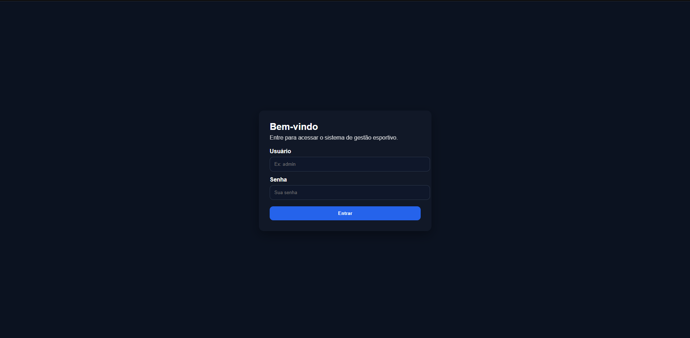
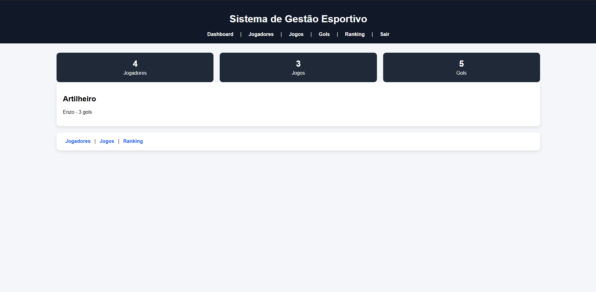
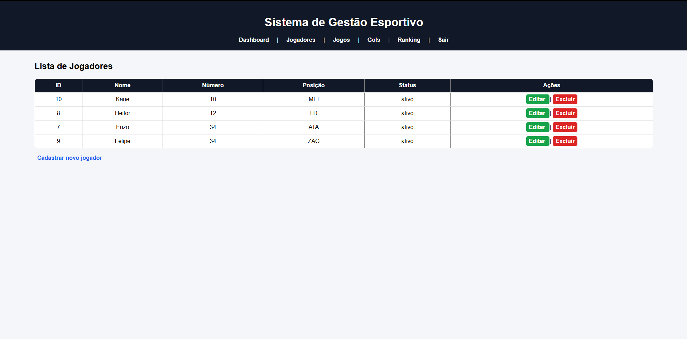
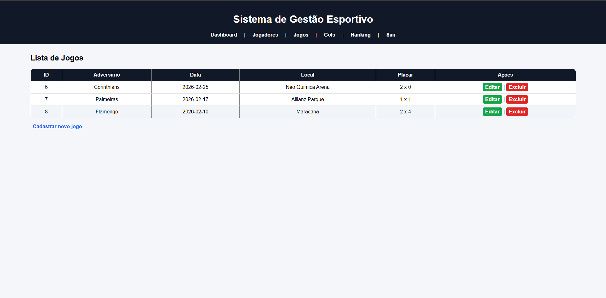
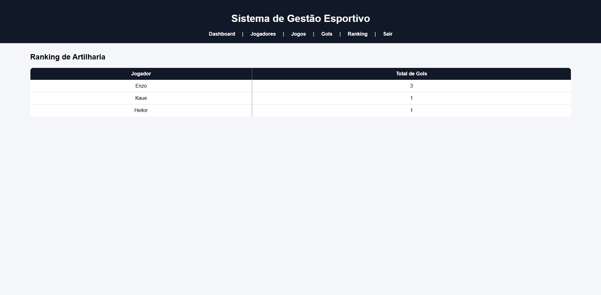

# ⚽ Sistema de Gestão Esportivo

Sistema web completo para gestão esportiva desenvolvido com **PHP, MySQL, HTML e CSS**.

Permite gerenciamento de jogadores, jogos, registro de gols e ranking automático de artilharia.

---

## 🚀 Funcionalidades

- 🔐 Sistema de Login com controle de sessão
- 👤 CRUD completo de Jogadores
- 🏟️ CRUD completo de Jogos
- ⚽ Registro, edição e exclusão de gols
- 🏆 Ranking automático de artilharia (usando JOIN e SUM no MySQL)
- 📊 Dashboard com estatísticas gerais

---

## 📷 Preview do Sistema

### 🔐 Tela de Login

### 📊 Dashboard

### 👤 Jogadores

### 🏟️ Jogos

### 🏆 Ranking

---

## 🛠️ Tecnologias Utilizadas

- PHP
- MySQL
- HTML
- CSS
- XAMPP (ambiente local)
- Git & GitHub

---

## 🧠 Conceitos Aplicados

- Estruturação de projeto em pastas (auth, config, módulos)
- Controle de sessão
- Organização modular
- Relacionamento entre tabelas (jogadores, jogos, gols)
- Consultas com JOIN e agregações
- Versionamento com Git

---

## 📂 Estrutura do Projeto

projeto-futebol/
│
├── auten/
├── config/
├── css/
├── jogadores/
├── jogos/
├── gols/
├── dashboard.php
├── ranking.php
└── README.md

---

## ▶️ Como Executar o Projeto

1. Instalar o XAMPP
2. Clonar o repositório
3. Colocar a pasta em: 
C:\xampp\htdocs\
4. Criar o banco de dados no MySQL
5. Importar as tabelas
6. Iniciar Apache e MySQL
7. Acessar:
http://localhost/projeto-futebol

---

## 📌 Observações

Projeto desenvolvido com foco em aprendizado prático de desenvolvimento backend com PHP e organização modular de sistemas web.

---

## 👨‍💻 Autor

João Pedro de Mattos Patricio.